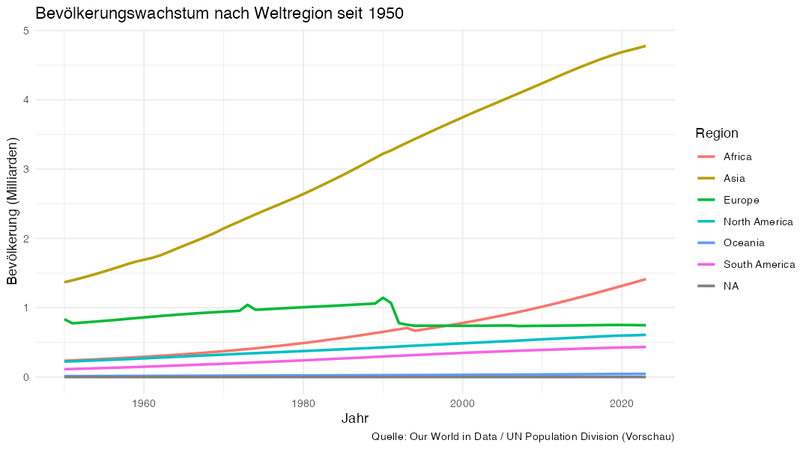

# Hausaufgaben Session 5 — Daten transformieren und zusammenfassen

**Seminar:** Globale Ungleichheit · Wintersemester 2025/26

---

## Inhaltsverzeichnis

- [Dein Endprodukt](#endprodukt)
- [Wo du arbeitest](#wo-du-arbeitest)
- [Neue Werkzeuge dieser Session](#neue-werkzeuge)
- [Hausaufgaben](#hausaufgaben)
  - [HA1 · Analyse-Datensatz erstellen](#ha1)
  - [HA2 · Weltbevölkerung: zusammenfassen und visualisieren](#ha2)
  - [HA3 · CO₂-Emissionen: Verteilung und Gruppenvergleich](#ha3)
  - [HA4 · Pro-Kopf-Emissionen mit `mutate()` berechnen](#ha4)
  - [HA5 · Pro-Kopf-Emissionen über die Zeit](#ha5)
  - [HA6 · Plastikmüll: eine Querschnittsanalyse](#ha6)
  - [Bonus-Hausaufgaben](#bonus-hausaufgaben)
- [Abgabe](#abgabe)

---

<h2 id="endprodukt">Dein Endprodukt</h2>

**Fragen dieser Session:**

In dieser Session dreht sich alles um Fragen der Nachhaltigkeit aus einer Perspektive globaler Ungleichheit. Wir werden uns mit Fragen beschäftigen wie:

- Wie hat sich die Weltbevölkerung seit 1950 entwickelt — und welche Regionen treiben das Wachstum?
- Welche Länder und Regionen stoßen den größten Anteil der globalen CO₂-Emissionen aus?
- Wenn wir nach Bevölkerungsgröße normieren — ändert sich das Bild?
- Welche Länder produzieren am meisten Plastikmüll, und wer exportiert am meisten dieses Mülls?

Am Ende der Übungen wirst du u. a. **Linienplots**, **Histogramme**, **Streudiagramme** und **Zusammenfassungstabellen** erstellt haben — ähnlich den Vorschauen unten (ohne dass du hier schon den Lösungscode siehst).

### Beispiel: Bevölkerungswachstum nach Region (Ü3)



*Vorschau aus demselben OWID-Datensatz wie in den Übungen; Form und Beschriftung entsprechen dem Linienplot in Ü3 D.*

### Beispiel: CO₂-Anteile nach Weltregion, 2022 (Ü4 C)

| Weltregion    | Summe CO₂-Anteile (%) | Mittelwert pro Land (%) | Anzahl Länder |
|---------------|----------------------:|------------------------:|--------------:|
| Asia          | 59,3                  | 1,16                    | 51            |
| North America | 16,6                  | 0,49                    | 34            |
| Europe        | 13,6                  | 0,31                    | 44            |
| South America | 2,9                   | 0,24                    | 12            |
| Africa        | 2,7                   | 0,05                    | 53            |
| Oceania       | 1,2                   | 0,06                    | 19            |

*Vorschau-Tabelle: `group_by(world_region)` + `summarize()` auf `share_global_co2` (Jahr 2022), sortiert nach `sum_co2`. Die Summe über alle Regionen kann von 100 % abweichen, weil nicht jedes Land Daten für 2022 hat.*

---

<h2 id="wo-du-arbeitest">Wo du arbeitest</h2>

Alle Code-Aufgaben bearbeitest du in:

**`scripts/session_05_skript.R`**

Führe zuerst den **SETUP-Abschnitt** aus — er lädt die Pakete und den Rohdatensatz.

> **`owid_data.csv` liegt unter `full_data/`** im Hauptordner des Repos. Wenn ein „Datei nicht gefunden"-Fehler erscheint, vergleiche deine Ordnerstruktur mit der im Repo.

---

<h2 id="neue-werkzeuge">Neue Werkzeuge dieser Session</h2>

Bevor du mit den Hausaufgaben beginnst, lies diesen Abschnitt durch. Er erklärt alle neuen Funktionen, die du heute brauchst. Du kannst jederzeit hierher zurückblättern.

---

<h2 id="Übungen">Übungen</h2>

<h3 id="üb1">Ü1 · Analyse-Datensatz erstellen</h3>

### Ziel

Für diese Session erstellst du deinen Übungs-Datensatz selbst! 🔥😱💪 Dazu brauchst du neben `filter()` aus der letzten Woche auch `select()`.

`select()` erlaubt dir, Spalten (=Variablen) auszuwählen. Datensätze haben oft Dutzende Spalten, von denen du nur wenige brauchst. `select()` wählt genau die Spalten aus, die du behalten möchtest — alles andere wird weggelassen:

```r
owid_daten |>
  select(country, year, child_mortality_rate)
```

Das Ergebnis ist ein neues Tibble mit nur diesen drei Spalten: `country`, `year`, `child_mortality_rate`. Die ursprünglichen Daten bleiben unverändert — du musst das Ergebnis mit `<-` speichern, wenn du es weiterbenutzen möchtest:

```r
owid_daten_child_mortality <- owid_daten |>
  select(country, year, child_mortality_rate)
```

Für die heutige Session und die dazu gehörigen Hausaufgaben brauchen wir die Variablen `country`, `year`, `population`, `share_global_co2`, `cumulative_co2`, `plastic_waste_generation` und `plastic_waste_exports`. Diese müssen wir per `select()` auswählen. Außerdem fokussieren wir uns auf die Zeit seit 1950. Dafür nutzen wir `filter()`. Der komplette Befehl sieht folgendermaßen aus:

```r
session_daten <- owid_daten |>
  filter(year >= 1950) |>
  select(country, world_region, year, population, share_global_co2,
         cumulative_co2, plastic_waste_generation, plastic_waste_exports)

```

> **Was passiert hier?**
> - Wir nehmen uns den Datensatz `owid_daten` vor UND DANN (`|>`)
> - benutzen wir `filter(year >= 1950)` um nur Daten seit 1950 einzubeziehen ()`>=` stellt sicher, dass 1950 mit eingeschlossen ist. Würden wir `>` nutzen, wäre 1950 ausgeschlossen und wir hätten nur Daten ab 1951.) UND DANN (`|>`)
> - nutzen wir `select(...)` um nur nur die für diese Session relevanten Spalten auszuwählen.

`select` hat neben der direkten Auflistung aller gewünschter Variablen noch einige weitere praktische Möglichkeiten. Z.B. können wir alle Variablen auswählen mit einem bestimmten Wort im Namen. Mit `owid_daten %>% select(starts_with("headcount"))` wählen wir zum Beispiel alle Variablen aus, die das Wort "headcount" als Teil ihres Namens haben.


### Deine Aufgaben

Schreibe den Code in den Abschnitt **Ü1** in `scripts/session_05_skript.R`.

a) Kopiere den Code zur Erstellung des Datensatzes ins Skript und führe ihn aus. Wende dann `glimpse()` auf `session_daten` an. Notiere als Kommentar: Wie viele Zeilen und Spalten hat der neue Datensatz?

b) Wende `summary()` auf `session_daten` an. Welche Variable hat die meisten fehlenden Werte — und warum könnte das so sein? (1–2 Sätze als Kommentar)

c)  Nutze `select(starts_with())` um aus dem vollen Datensatz `owid_daten` alle Variablen auszuwählen, deren Name mit "co2" anfängt. Du brauchst kein neues Objekt zu erschaffen, schreib den Code einfach ins Skript und führe ihn aus. Wie viele Variablen werden ausgewählt? Wenn du mit diesen Variablen wirklich arbeiten wolltest, welche weiteren Variablen müsstest du dann auf jeden Fall zusätzlich auswählen


<br>

<details>
<summary><strong>Tipp</strong></summary>

`glimpse()` und `summary()` kennst du schon aus Session 4 — wende sie einfach auf `session_daten` an. 

Für c): Stell sicher, dass du "co2" auch im Befehl in Anfürungszeichen gesetzt hast.

</details>

<br>

<details>
<summary><strong>Lösung</strong></summary>

```r
# a)
glimpse(session_daten)
# Ca. 30.000 Zeilen, 8 Spalten

#b)
summary(session_daten)
# plastic_waste_generation hat mit Abstand die meisten NAs — diese Variable
# wurde nur für das Jahr 2010 erhoben, nicht als Zeitreihe.

# c)
owid_daten %>% select(starts_with("co2"))

# Fünf Spalten werden durch starts_with("co2") angwählt. Um mit diesen Spalten tatsächlich zu arbeiten, bräuchtest du auf jeden Fall noch `country` und `year`, um die Werte den Beobachtungen (Land in Jahr) zuordnen zu können.

```

</details>

<br>

<p align="right"><a href="#inhaltsverzeichnis"><strong>Zurück zum Inhaltsverzeichnis</strong></a></p>

---

<h3 id="üb2">Ü2 · Daten sortieren und hohe/niedrige Werte anzeigen</h3>

### Ziel
Wir wollen unseren Daten ein bisschen erkunden und dafür uns die höchsten und niedrigsten Werte anzeigen lassen. Das ist ein sehr typischer Schritt, wenn wir Daten analysieren. Dafür müssen Daten anhand der Werte einer Variable soriteren und uns dann die höchsten oder niedrigsten Werte ausgeben lassen. Das können wir mit den Funktionen `arrange()` und `slice_head()` bzw. `slice_tail()` tun.

`arrange()` sortiert den Datensatz nach einer oder mehreren Spalten — standardmäßig aufsteigend (kleinste Werte zuerst):

```r
session_daten |>
  arrange(population)   # kleinste Population zuerst
```

Mit `desc()` (*descending*) wird absteigend sortiert — also größte Werte zuerst. Wir schachteln `desc()` nach `arrange()` in den selben Befehl, und zwar so:

```r
session_daten |>
  arrange(desc(population))   # größte Population zuerst
```

Das ist besonders nützlich, um schnell die „Top 10" oder „Bottom 10" eines Datensatzes zu sehen.

---

### `slice_head()` / `slice_tail()` — Die ersten/letzten n Zeilen

`slice_head(n = 10)` zeigt nur die ersten 10 Zeilen — praktisch nach `arrange()`, um die größten oder kleinsten Werte zu sehen:

```r
session_daten |>
  arrange(desc(population)) |>
  slice_head(n = 10)
```

`slice_tail(n = 10)` verhält sich spiegelbildlich, das heißt es zeigt nur die letzten 10 Zeilen.


### Deine Aufgabe

Schreibe den Code in den Abschnitt **Ü2** in `scripts/session_05_skript.R`.

Beantworte die Frage: Welche Regionen sind unter den Top-10-bevölkerungsreichsten Ländern vertreten? Verwende dazu `filter()` um das Jahr auszuwählen und Zeilen auszuschließen, die für die Variable `population` einen fehlenden Wert haben, `select()` um die Variablen auszuwählen, die du betrachten möchtest, `arrange()` und `desc()` um die Daten in absteigender Reihenfolge zu sortieren und `slice_head()`, um die 10 Länder mit der höchsten Bevölkerungszahl anzuzeigen. 

 <br>

<details>
<summary><strong>Tipp</strong></summary>

Nutze die Pipe (`|>`) um die Befehle aneinander zu reihen.
Um fehlende Werte auszuschließen, nutze innerhalb von `filter()` `!is.na()` (sprich: ist NICHT NA). Trenne den Befehl vom filter-Befehl für das Jahr durch ein Komma.


</details>

<br>

<details>
<summary><strong>Lösung</strong></summary>

```r

session_daten |>
  filter(year == 2023, !is.na(population)) |>
  arrange(desc(population)) |>
  slice_head(n = 10)


# Unter den Top 10 dominieren Asien (Indien, China, Pakistan, Bangladesh,
# Indonesien, Japan) und Afrika (Nigeria, Äthiopien). USA und Brasilien
# vertreten Nord- und Südamerika.

```


</details>

<br>

<p align="right"><a href="#inhaltsverzeichnis"><strong>Zurück zum Inhaltsverzeichnis</strong></a></p>


---

<h3 id="üb3">Ü3 · Weltbevölkerung: zusammenfassen und visualisieren</h3>

### Ziel

Wie hat sich die Weltbevölkerung seit 1950 entwickelt? Und welche Regionen treiben das Wachstum? Um diese Frage zu beantworten wirst du lernen, Daten nach Gruppen zusammenzufassen und das Ergebnis zu visualisieren.

Achtung: Unser Datensatz `session_daten` enthält 140 Länder — aber nicht alle Länder der Welt. Die Bevölkerungssummen, die du gleich berechnen wirst, decken daher nur einen Teil der echten Weltbevölkerung ab (ungefähr 68%). Das ist wichtig für die Interpretation: Du siehst echte Muster und Trends — aber absolute Zahlen sind etwas niedriger als die tatsächlichen Gesamtzahlen.

### `group_by()` + `summarize()` — Gruppen zusammenfassen

Die beiden Funktionen sind *extrem* nützlich und finden ständig Anwendung in der praktischen Datenanalyse. Die Idee:

1. **`group_by([EINE GRUPPE])`** teilt den Datensatz gedanklich in Gruppen auf — z. B. eine Gruppe pro Region.
2. **`summarize()`** berechnet dann einen Wert *für jede Gruppe* — z. B. die Summe oder den Mittelwert. Ein Beispiel:

```r
session_daten |>
  filter(year == 2010) |>
  group_by(world_region) |>
  summarize(
    mittlere_co2 = mean(cumulative_co2, na.rm = TRUE),
    anzahl_laender = n()
  )
```

Was hier passiert:
> - Wir nehmen den Datensatz `session_daten` UND DANN
> - filtern wir die Zeilen zum Jahr 2010 heraus UND DANN
> - gruppieren wir anhand der `world_region` UND DANN
> - Berechnen wir für jede Gruppe den durchschnittlichen kumulierten `co2` Verbrauch sowie die Anzahl der Länder in dieser Region (mit Hilfe des Befehls `n()`).

Das Ergebnis ist ein neues Tibble mit einer Zeile pro Gruppe und jeweils einer Spalte für die beiden berechneten Werte. Kopiere den Code oben in dein Terminal und drücke `Enter`, um dir das Ergebnis anzuschauen und ein Gespür dafür zu bekommen, was `summarize()` macht.
Ein weiterer Hinweis: Du kannst `summarize()` natürlich auch ohne `group_by` einsetzen. Dann wir einfach der komplette Datensatz zusammengefasst, ohne nach Gruppen zu unterteilen:

```r
session_daten |>
  filter(year == 2010) |>
  summarize(
    mittlere_co2 = mean(cumulative_co2, na.rm = TRUE),
    anzahl_laender = n()
  )
```

Der Output dieses Befehls sind zwei Spalten (`mittlere_co2` und `anzahl_laender`) mit jeweils einem Wert.


### Schritt-für-Schritt-Erklärung: Bevölkerung summieren

Um die Gesamtbevölkerung über alle Länder pro Jahr zu berechnen, nutzen wir `group_by()` + `summarize()` und weisen das Ergebnis dem Objekt `welt_pop` zu:

```r
welt_pop <- session_daten |>
  group_by(year) |>
  summarize(gesamt_pop = sum(population, na.rm = TRUE))
```

Das ergibt einen neuen Tibble mit genau einer Zeile pro Jahr — und einer Spalte `gesamt_pop`, die die Summe über alle Länder enthält.


### Deine Aufgaben

Schreibe den Code in den Abschnitt **Ü3** in `scripts/session_05_skript.R`.

#### Ü3 A: Aktuelle Gesamtbevölkerung

Berechne die Gesamtbevölkerung der aller Länder im Jahr 2023. Notiere als Kommentar: In welcher Größenordnung liegt das Ergebnis?


#### Ü3 B: Gesamtbevölkerung nach Weltregion (2023)

Erweitere die Berechnung auf Regionenebene. Füge `group_by(world_region)` vor `summarize()` ein und sortiere das Ergebnis absteigend. Notiere als Kommentar: Welche Region hat die größte Bevölkerung?


#### Ü3 C: Bevölkerungswachstum über die Zeit — Daten vorbereiten

Erstelle den Tibble `pop_pro_jahr_region`, indem du per `group_by(year, world_region)` sowohl nach Jahr als auch nach Region gruppierst und dann den `summarize()` Befehl verwendest. Schließe vor dem `summarize()`-Befehl per `filter()` fehlende Werte auf der Variable `population` aus.

Wende `glimpse()` auf das Ergebnis an. Was ist jetzt eine Zeile im Datensatz?


#### Ü3 D: Linienplot nach Region

Erstelle einen Linienplot mit `year` auf der x-Achse, `gesamt_pop` auf der y-Achse, und je einer Linie pro Region (über `color = world_region`). Beschrifte den Plot vollständig.

Weise den Plot dem Objekt `pop_lineplot` zu und speichere ihn:

```r
ggsave(here("output", "pop_wachstum_region.png"), plot = pop_lineplot, width = 9, height = 5)
```

Schreibe **3–4 Sätze Interpretation** als Kommentar: Welche Region wächst am stärksten? Welche stagniert? Was bedeutet das für zukünftige globale Ungleichheit? Was ist in Europa Anfang der 1990er Jahre los?

<br>

<details>
<summary><strong>Tipp zu Ü3</strong></summary>


- Starte mit `session_daten` und schränke zuerst auf **ein Jahr** ein (`filter()`).
- Für **eine einzige Zahl** über alle Länder brauchst du kein `group_by()` — nur `summarize()` mit `sum()` auf `population`.
- Denke an `na.rm = TRUE` in `sum()`, sonst kann ein fehlender Wert das ganze Ergebnis zu `NA` machen.
- Die Größenordnung in Milliarden erkennst du am Ergebnis: Teile gedanklich durch 1 Milliarde (`1e9`), um „Mrd." im Kommentar zu formulieren.

**Ü3 B**

- Baue auf Ü3 A auf: dieselbe Jahresfilterung, dann **`group_by(world_region)`** *vor* `summarize()`.
- In `summarize()` kannst du dieselbe Summenlogik wie in A verwenden — der Unterschied ist nur die Gruppierung.
- Für „größte Region zuerst": nach `summarize()` noch `arrange(desc(...))` an die Pipe hängen.
- Das Ergebnis hat **eine Zeile pro Region**.

**Ü3 C**

- Reihenfolge in der Pipe: zuerst fehlende `population`-Werte ausschließen (`filter()` mit `!is.na(...)`), **dann** gruppieren, **dann** summieren.
- `group_by()` nimmt hier **zwei** Spalten — damit wird jede Zeile im Ergebnis zu **einem Jahr × eine Region**.
- Weise die gesamte Pipe dem Objekt `pop_pro_jahr_region` zu (`<-`), damit du es in Ü3 D wiederverwenden kannst.
- `glimpse()` danach: Zähle Spalten und Zeilen — passt die Anzahl der Zeilen zu „Jahre × Regionen"?

**Ü3 D**

- Plot-Datenquelle ist **`pop_pro_jahr_region`** aus Ü3 C — nicht `session_daten`.
- Grundmuster wie beim Linienplot in Session 4: `ggplot(..., aes(x = year, y = ..., color = world_region))` + `geom_line()`.
- `labs()` nicht vergessen (Titel, Achsen, Legende für `color`).
- Speichern erst, wenn der Plot im Environment als `pop_lineplot` existiert.
- Optional: Wenn die y-Achse unleserlich groß wirkt, kannst du in `aes()` mit `gesamt_pop / 1e9` in **Milliarden** plotten — das ändert nur die Darstellung, nicht die Daten selbst. `1e9` = `1000000000` = 1 Mrd.
- Für die Interpretation zu Europa Anfang der 1990er: Schau dir die **europäische Linie** in diesem Zeitraum an — denk an politische Umbrüche und Datenlage (z. B. Zusammenführung / Zerfall von Staaten im Datensatz).

</details>

<br>

<details>
<summary><strong>Lösung</strong></summary>

```r
# HA2 A
session_daten |>
  filter(year == 2023) |>
  summarize(gesamt_pop = sum(population, na.rm = TRUE))

Die Weltbevölkerung laut unserem Datensatz lag im Jahr 2023 bei ca. 8,02 Mrd. Menschen.

# HA2 B
session_daten |>
  filter(year == 2023) |>
  group_by(world_region) |>
  summarize(gesamt_pop = sum(population, na.rm = TRUE)) |>
  arrange(desc(gesamt_pop))
# Asien hat mit Abstand die größte Bevölkerung (fast 5 Milliarden im Datensatz).

# HA2 C
pop_pro_jahr_region <- session_daten |>
  filter(!is.na(population)) |>
  group_by(year, world_region) |>
  summarize(gesamt_pop = sum(population))

glimpse(pop_pro_jahr_region)
# Jetzt ist eine Zeile = ein Jahr + eine Region. Statt 10.600 Länder-Jahr-Zeilen
# haben wir ca. 530 Region-Jahr-Zeilen.

# HA2 D
pop_lineplot <- pop_pro_jahr_region |>
  ggplot(aes(x = year, y = gesamt_pop, color = world_region)) +
    geom_line(linewidth = 1) +
    labs(
      title   = "Bevölkerungswachstum nach Weltregion seit 1950",
      x       = "Jahr",
      y       = "Bevölkerung (Milliarden)",
      color   = "Region",
      caption = "Quelle: Our World in Data / UN Population Division"
    )

pop_lineplot

ggsave(here("output", "pop_wachstum_region.png"), plot = pop_lineplot, width = 9, height = 5)

# Asien und Afrika wachsen am stärksten. Europa stagniert seit den 1990ern.
# Das bedeutet: Der globale Schwerpunkt der Weltbevölkerung verschiebt sich
# weiter nach Süden und Osten — mit weitreichenden Konsequenzen für
# Ressourcennutzung, Emissionen und Entwicklungspolitik.
# Die plötzliche Abnahme der Bevölkerung in Europa hat vermutlich damit zu tun, dass die Sovietunion zu Europa gezählt wurde und einige der Nachfolgestaaten zu Asien gezählt werden. Wir könnten das z.B. nachprüfen, indem wir statt der Population die Anzahl der Länder pro Region über die Zeit plotten.
```

</details>

<br>

<p align="right"><a href="#inhaltsverzeichnis"><strong>Zurück zum Inhaltsverzeichnis</strong></a></p>

---

<h3 id="üb3">Ü4 · CO₂-Emissionen: Verteilung und Gruppenvergleich</h3>

### Ziel

Wer ist verantwortlich für den globalen CO₂-Ausstoß? Du untersuchst die Verteilung des CO₂-Anteils über Länder und Regionen — erst durch ein Histogramm, dann durch Gruppenstatistiken.

### Hintergrund zur Variable

`share_global_co2` gibt an, welchen Prozentsatz der weltweiten CO₂-Emissionen ein Land in einem Jahr ausgestoßen hat. Ein Wert von `28.9` bedeutet: Dieses Land war für 28,9 % der globalen Emissionen verantwortlich.

### Deine Aufgaben

Schreibe den Code in den Abschnitt **Ü4** in `scripts/session_05_skript.R`.

#### Ü4 A: Überblick verschaffen

Filtere auf das Jahr 2022, entferne fehlende Werte auf `share_global_co2` und speichere das Ergebnis in `co2_2022`. Nutze dann `nrow()` auf den neuen Datensatz und `summary()` auf `share_global_co2`. Wie viele Länder sind für 2022 im Datensatz, und was fällt dir beim `summary()`-Output auf?

Notiere als Kommentar: Warum ist der Median so viel kleiner als der Mittelwert?


#### Ü4 B: Histogramm der CO₂-Verteilung

Erstelle ein Histogramm von `share_global_co2` aus `co2_2022`. Beschrifte den Plot vollständig. Speichere ihn als `co2_histogram`. Führe dann folgenden Code aus, um den Plot auf deiner Festplatte zu speichern:

```r

ggsave(here("output", "co2_histogramm_2022.png"), plot = co2_histogram, width = 8, height = 5)

```


Schreibe **2–3 Sätze Interpretation**: Was sagt die Form der Verteilung über die Ungleichheit bei CO₂-Emissionen?


#### Ü4 C: Zusammenfassung nach Weltregion

Berechne für das Jahr 2022 nach Weltregion für `share_global_co2`:

- die Summe der CO₂-Anteile (`sum_co2`)
- den Mittelwert über Länder (`mean_co2`)
- die Anzahl der Länder (`n_laender = n()`)

Sortiere das Ergebnis nach `sum_co2` absteigend.

Notiere als Kommentar: Welche Region emittiert am meisten? Verändert sich das Bild, wenn du `sum_co2` durch `mean_co2` ersetzt — und was erklärt das?


#### Ü4 D: Top-10-Emittenten 2022

Verwende `arrange()` und `slice_head()`, um die 10 Länder mit dem höchsten CO₂-Anteil im Jahr 2022 zu finden. Zeige dabei `country`, `world_region` und `share_global_co2`.

Schreibe 2–3 Sätze: Welche Länder dominieren — und überrascht dich etwas?

<br>

<details>
<summary><strong>Tipps zu Ü4</strong></summary>

**Ü4 A**

- Baue `co2_2022` als **eigenes Objekt** mit `<-` — du brauchst es in B, C und D erneut.
- Reihenfolge in der Pipe: zuerst `filter(year == 2022)`, dann fehlende Werte auf `share_global_co2` entfernen (`!is.na(...)`).
- `nrow()` zählt **Zeilen** (= Länder mit gültigem Wert in 2022), nicht die Weltbevölkerung.
- `summary()` auf **eine Spalte** gehst du mit `$` ran: `summary(co2_2022$share_global_co2)`.
- Median vs. Mittelwert: Wenn der Mittelwert deutlich höher ist, denk an **wenige sehr große Werte** (große Emittenten) und viele sehr kleine — das ist typisch für eine rechtsschiefe Verteilung.

**Ü4 B**

- Plot-Datenquelle ist **`co2_2022`** aus Ü4 A — nicht der gesamte `session_daten`.
- Grundmuster aus Session 4: `ggplot(..., aes(x = share_global_co2))` + `geom_histogram()`.
- Weise den beschrifteten Plot **`co2_histogram`** zu, bevor du `ggsave()` ausführst — der vorgegebene Speicherbefehl erwartet genau dieses Objekt.
- Achsenbeschriftung: Erkläre in `x`, dass es sich um den **globalen Anteil in Prozent** handelt.
- Zur Interpretation: Schau, ob die meisten Balken **links** (sehr kleine Anteile) liegen und nur wenige rechts — was bedeutet das für „Wer emittiert wie viel?"

**Ü4 C**

- Starte wieder bei **`co2_2022`** (oder filtere erneut auf 2022 — aber das Objekt aus A spart Arbeit).
- `group_by(world_region)` **vor** `summarize()` — sonst bekommst du nur eine Zeile für die ganze Welt.
- In `summarize()` kannst du **mehrere** neue Spalten auf einmal anlegen (`sum_co2 = ...`, `mean_co2 = ...`, `n_laender = n()`).
- `n()` zählt Zeilen **pro Gruppe** — also Länder pro Region, nicht Jahre.
- Sortieren: `arrange(desc(sum_co2))` nach dem `summarize()`.
- Sum vs. Mittelwert: **Summe** bevorzugt Regionen mit **vielen** Ländern; **Mittelwert** vergleicht eher das „typische" Land in der Region — große Regionen mit vielen kleinen Emittenten können sich dadurch anders ranken.

**Ü4 D**

- Wieder **`co2_2022`** als Ausgangspunkt.
- `arrange(desc(share_global_co2))` sortiert die größten Emittenten nach oben — `desc()` nicht vergessen.
- `slice_head(n = 10)` nimmt danach die ersten 10 Zeilen.
- Zeige nur die Spalten, die du brauchst: `select(country, world_region, share_global_co2)` — entweder in der Pipe oder mit `select()` vor dem Anzeigen.

</details>

<br>

<details>
<summary><strong>Lösung</strong></summary>

```r
# HA3 A
co2_2022 <- session_daten |>
  filter(year == 2022) |>
  filter(!is.na(share_global_co2))

nrow(co2_2022)   # ca. 214 Länder
summary(co2_2022$share_global_co2)
# Median ist sehr klein (ca. 0.03%), Mittelwert viel größer (ca. 0.45%).
# Das liegt daran, dass die Verteilung stark rechtsschief ist: Wenige große
# Emittenten heben den Mittelwert deutlich an, während die meisten Länder
# einen winzigen Anteil haben.

# HA3 B
co2_histogram <- co2_2022 |> 
ggplot(aes(x = share_global_co2)) +
  geom_histogram(bins = 30, fill = "#c0392b", color = "white") +
  labs(
    title    = "Verteilung der CO₂-Anteile nach Ländern (2022)",
    subtitle = "Anteil an globalen CO₂-Emissionen in Prozent",
    x        = "Anteil an globalen CO₂-Emissionen (%)",
    y        = "Anzahl Länder",
    caption  = "Quelle: Our World in Data / Global Carbon Project"
  )

co2_histogram
ggsave(here("output", "co2_histogramm_2022.png"), plot = co2_histogram, width = 8, height = 5)

# Die Verteilung ist extrem rechtsschief: Fast alle Länder emittieren unter 1%,
# während ein Handvoll Länder Anteile von 5–30% aufweisen. Mann sieht sie teilweise kaum im Plot.
# Das zeigt eine massive Ungleichheit beim CO₂-Ausstoß.

# HA3 C
co2_2022 |>
  group_by(world_region) |>
  summarize(
    sum_co2   = sum(share_global_co2, na.rm = TRUE),
    mean_co2  = mean(share_global_co2, na.rm = TRUE),
    n_laender = n(),
    .groups   = "drop"
  ) |>
  arrange(desc(sum_co2))

# Asien emittiert mit Abstand am meisten (sum_co2). Nach Mittelwert pro Land
# verschiebt sich das Bild etwas: Ozeanien hat einen höheren Mittelwert
# als Afrika, weil dort weniger, aber größere Emittenten enthalten sind.


# HA3 D
co2_2022 |>
  select(country, world_region, share_global_co2) |>
  arrange(desc(share_global_co2)) |>
  slice_head(n = 10)

# Die Top-Emittenten sind China, USA, India, Russland, Japan, Iran, Indonesia, Deutschland —
# also die größten Volkswirtschaften und sehr bevölkerungsreiche Nationen. Überraschend: Obwohl Afrika die
# zweitgrößte Bevölkerung hat, erscheint kein afrikanisches Land in den Top 10.
```

</details>

<br>

<p align="right"><a href="#inhaltsverzeichnis"><strong>Zurück zum Inhaltsverzeichnis</strong></a></p>

---

<h3 id="üb5">Ü5 · Pro-Kopf-Emissionen mit `mutate()` berechnen</h3>

### Ziel

Ein Land mit 1,4 Milliarden Einwohner:innen (China) und ein Land mit 80 Millionen (Deutschland) sind schwer direkt zu vergleichen. Pro-Kopf-Werte normieren nach Bevölkerungsgröße — und können das Bild erheblich verändern.

In dieser Aufgabe erstellst du zwei neue Variablen: den CO₂-Anteil pro Kopf und die kumulierten Emissionen pro Kopf. Neue Variablen können wir mit der Funktion `mutate()` erstellen.

### `mutate()` — Neue Spalten berechnen

`mutate()` fügt dem Datensatz eine neue Spalte hinzu, die aus bestehenden Spalten berechnet wird:

```r

owid_daten |>
  mutate(co2_pro_kopf = cumulative_co2 / population)

```

Was hier passiert:
> -Wir nehmen den `owid_daten`-Datensatz UND DANN
> -erstellen wir eine neue Variable `co2_pro_kopf`, indem wir die Variable `cumulative_co2` durch die Variable `population` teilen. Das passiert für jede Zeile einzeln.

Der ursprüngliche Datensatz bekommt die neue Spalte hinzu — alle anderen Spalten bleiben erhalten. Du kannst mehrere neue Spalten auf einmal erstellen:

```r

owid_daten |>
  mutate(co2_pro_kopf = cumulative_co2 / population,
         pop_in_millionen  = population / 1e6)

```

### Deine Aufgaben

Schreibe den Code in den Abschnitt **Ü5** in `scripts/session_05_skript.R`.

#### Ü5 A: Pro-1Mio-Variablen berechnen

Füge dem Datensatz `session_daten` zwei neue Spalten hinzu und speichere das Ergebnis als `session_daten_mutated`: 

- `co2_pro_1mio`, die du berechnest, indem du `share_global_co2` durch `population` teilst und dann mit 1000000 (anders geschrieben: 1e6) multiplizierst.
- `kumulativ_co2_pro_1mio`, für die du gleich vorgehst, nur dass du die Variable `cumulative_co2` verwendest.

> **Warum `* 1e6`?** `share_global_co2` ist in Prozent, `population` in absoluten Zahlen. Die Multiplikation mit 1.000.000 skaliert das Ergebnis in eine interpretierbare Einheit: Prozentpunkte globaler Emissionen pro Million Einwohner:innen. Das klingt technisch — für den Plot ist es wichtig, dass du die Achsenbeschriftung entsprechend formulierst.


#### Ü5 B: Plausibilitätscheck

Filtere den neuen Datensatz `session_daten_mutated` auf das Jahr 2022, wähle die Variablen `country`, `world_region`, `share_global_co2`, `population`, `co2_pro_1mio` aus, ordne absteigend nach `co2_pro_1mio` und lass dir die höchsten 10 Werte anzeigen.
Notiere als Kommentar: Welche Länder erscheinen jetzt in den Top 10 — und unterscheidet sich das von den Top-10-Emittenten aus Ü4 D? Was erklärt den Unterschied?


#### HA4 C: Zusammenfassung nach Region (pro 1mio)

Entferne fehlende Werte und berechne den **Mittelwert von `co2_pro_1mio`** nach Weltregion für 2022. Notiere als Kommentar: Hat sich die Rangfolge der Regionen im Vergleich zu Ü4 C verändert? Was bedeutet das?

<br>

<details>
<summary><strong>Tipps zu Ü5</strong></summary>

**Ü5 A**

- `mutate()` hängst du an **`session_daten`** — nicht an `owid_daten`, wenn du den Übungsdatensatz nutzen willst.
- Beide neue Spalten kannst du **in einem** `mutate()`-Aufruf anlegen (zwei Zeilen, durch Komma getrennt).
- Formel für beide: **Variable ÷ `population` × `1e6`** — bei der zweiten Spalte nur `cumulative_co2` statt `share_global_co2` einsetzen.
- Das Ergebnis mit `<-` in **`session_daten_mutated`** speichern, sonst verschwinden die neuen Spalten nach dem Ausführen.
- Wenn du `NA` in `population` oder den Ausgangsvariablen hast, wird die neue Spalte dort ebenfalls `NA` — das ist normal und wird in B und C relevant.

**Ü5 B**

- Ausgangspunkt ist **`session_daten_mutated`** aus Ü5 A — nicht nochmal `mutate()` aufrufen.
- Reihenfolge in der Pipe: `filter(...)` → `select(...)` → `arrange(desc(...))` → `slice_head(...)`.
- `select()` **vor** `arrange()` ist oft übersichtlicher — du sortierst nur die Spalten, die du wirklich sehen willst.
- Vergleich zu Ü4 D: Dort ging es um **`share_global_co2`** (absoluter Anteil am Welt-CO₂) — hier um **`co2_pro_1mio`** (nach Bevölkerung skaliert). Kleine, reiche Länder können nach oben rutschen; sehr bevölkerungsreiche Großemittenten nach unten.
- Im Kommentar reicht es, **2–3 konkrete Länder** zu nennen, die sich ändern, plus **eine** Erklärung (Bevölkerungsgröße im Nenner).

**Ü5 C** *(Aufgabe HA4 C im Skript)*

- Wieder **`session_daten_mutated`**, Jahr **2022**.
- Fehlende Werte auf der **neuen** Variable ausschließen: `!is.na(co2_pro_1mio)` im `filter()`.
- Dann `group_by(world_region)` und in `summarize()` den **Mittelwert** von `co2_pro_1mio` (nicht die Summe wie in Ü4 C).
- `na.rm = TRUE` in `mean()` ist sinnvoll, falls doch noch einzelne `NA` übrig bleiben.
- Zum Vergleich mit Ü4 C: Dort war **`sum_co2`** pro Region entscheidend — hier **`mean(...)`** pro Region. Frage dich: Welche Region hat viele kleine Länder vs. wenige große? Das kann die Rangfolge verschieben.
- Optional: Ergebnis mit `arrange(desc(...))` sortieren, damit die „höchste" Region oben steht.

</details>

<br>

<details>
<summary><strong>Lösung</strong></summary>

```r
# HA4 A
session_daten_mutated <- session_daten |>
  mutate(
    co2_pro_1mio           = share_global_co2 / population * 1e6,
    kumulativ_co2_pro_1mio = cumulative_co2   / population * 1e6
  )

# HA4 B
session_daten_mutated |>
  filter(year == 2022) |>
  select(country, world_region, share_global_co2, population, co2_pro_1mio) |>
  arrange(desc(co2_pro_1mio)) |>
  slice_head(n = 10)

# Nach Bevölkerung skaliert erscheinen jetzt vor allem kleine, ressourcenreiche Länder:
# z. B. Qatar, Brunei, Kuweit, Trinidad & Tobago oder Bahrain Kasachstan. Russland
# China und Indien — absolute Top-Emittenten — verschwinden aus den Top 10,
# weil ihre riesige Bevölkerung die skalierten Emissionen stark drückt.
# Das zeigt: Die Frage "Wer emittiert am meisten?" hängt stark davon ab,
# ob man absolut misst oder die Bevölkerung in die Berechnung einbezieht.

# HA4 C
session_daten_mutated |>
  filter(year == 2022, !is.na(co2_pro_1mio)) |>
  group_by(world_region) |>
  summarize(mittleres_co2_pro_1mio = mean(co2_pro_1mio, na.rm = TRUE)) |>
  arrange(desc(mittleres_co2_pro_1mio))

# Pro 1 Mio. rückt Ozeanien (Australien dominiert die Region) nach oben,
# Afrika fällt weiter zurück. Asien bleibt hoch, ist aber nicht mehr
# so dominant wie bei der absoluten Summe. Das verschiebt die normative
# Frage: Wer trägt historisch und individuell Verantwortung für den Klimawandel?
```

</details>

<br>

<p align="right"><a href="#inhaltsverzeichnis"><strong>Zurück zum Inhaltsverzeichnis</strong></a></p>

---

<h3 id="üb6">Ü6 · Pro-Kopf-Emissionen über die Zeit</h3>

### Ziel

Du visualisierst, wie sich `co2_pro_1mio` in fünf ausgewählten Ländern seit 1950 entwickelt hat — und kombinierst dabei `filter()`, `geom_line()` und vollständige Beschriftung.


### Deine Aufgaben

Schreibe den Code in den Abschnitt **HA5** in `scripts/session_05_skript.R`.

#### Ü6 A: Datensatz filtern

Filtere `session_daten_mutated` auf die Länder `Germany`, `China`, `United States`, `Nigeria` und `Brazil`, und schließe fehlende Werte auf `co2_pro_1mio` aus. Weise das ganze dem neuen Objekt `laender_co2` zu.

Führe `glimpse(laender_co2)` aus. Wie viele Zeilen hat dieser Datensatz?


#### Ü6 B: Linienplot erstellen

Erstelle einen Linienplot mit `year` auf der x-Achse, `co2_pro_1mio` auf der y-Achse und einer Linie pro Land. Beschrifte vollständig und weise dem Plot das Objekt `co2_lineplot` zu.

Speichere den Plot:

```r
ggsave(here("output", "co2_pro_kopf_verlauf.png"), plot = co2_lineplot, width = 9, height = 5)
```

#### Ü6 C: Interpretation

Schreibe **4–5 Sätze** als Kommentar:

- Welches Land hatte historisch die höchsten Pro-1 Mio.-Emissionen?
- Was passiert mit der Kurve der USA seit den 1970ern?
- China wächst stark — aber auf welchem Niveau verglichen mit den USA?
- Was sagt das über die historische Verantwortung für den Klimawandel?

<br>

<details>
<summary><strong>Tipps zu Ü6</strong></summary>

**Ü6 A**

- Ausgangspunkt ist **`session_daten_mutated`** aus Ü5 — dort liegt `co2_pro_1mio` bereits vor.
- Für mehrere Länder auf einmal: `country %in% c("Germany", "China", ...)` — die Namen **exakt** wie im Datensatz (englisch, Großbuchstaben). Anführungszeichen nicht vergessen!
- Fehlende Werte: `!is.na(co2_pro_1mio)` im selben `filter()`-Aufruf (zweite Bedingung, durch Komma getrennt).
- Gesamte Pipe mit `<-` in **`laender_co2`** speichern.
- Zeilenanzahl bei `glimpse()`: Erwartung sind **viele Zeilen pro Land** (ein Jahr = eine Zeile) × 5 Länder — keine einzelne Zeile pro Land.

**Ü6 B**

- Plot-Datenquelle: **`laender_co2`** — nicht `session_daten` oder `session_daten_mutated` ungefiltert.
- Linienplot-Muster aus Session 4/Ü3: `ggplot(..., aes(x = year, y = co2_pro_1mio, color = country))` + `geom_line()`.
- `color = country` sorgt für **eine Linie pro Land** — ohne `color` würden alle Länder in einer Linie verschmelzen.
- `labs()`: Achse `y` sollte die Einheit aus Ü5 widerspiegeln (pro Million Einwohner:innen / Prozentpunkte global).
- Erst Plot **`co2_lineplot`** zuweisen und anzeigen, **dann** den vorgegebenen `ggsave()`-Befehl ausführen.

**Ü6 C**

- Schau dir den Plot **Land für Land** an — nicht nur das Endjahr.
- USA: Früher weit oben, dann stetig **fallend** — trotz hoher absoluter Emissionen.
- China: **Steigung** in späteren Jahrzehnten — vergleiche das **Niveau** (Höhe der Linie) mit USA und Deutschland, nicht nur die Geschwindigkeit des Anstiegs.
- Nigeria und Brasilien: Eher **niedrigere** Kurven — gut für den Vergleich „Entwicklungsland vs. Industrieland".
- Historische Verantwortung: Unterscheide **frühe** hohe Emissionen (Industrieland seit langem) von **spätem** starkem Anstieg (Industrialisierung) — beides zählt, aber anders.

</details>

<br>

<br>

<details>
<summary><strong>Lösung</strong></summary>

```r
# Ü6 A
laender_co2 <- session_daten_mutated |>
  filter(
    country %in% c("Germany", "China", "United States", "Nigeria", "Brazil"),
    !is.na(co2_pro_1mio)
  )

glimpse(laender_co2)
# 370 Zeilen

# Ü6 B
co2_lineplot <- ggplot(laender_co2, aes(x = year, y = co2_pro_1mio, color = country)) +
  geom_line(linewidth = 1) +
  labs(
    title   = "CO₂-Emissionen pro Kopf seit 1950",
    subtitle = "Anteil an globalen Emissionen pro Million Einwohner:innen",
    x       = "Jahr",
    y       = "CO₂-Anteil pro Million Einwohner:innen (%)",
    color   = "Land",
    caption = "Quelle: Our World in Data / Global Carbon Project"
  )

co2_lineplot
ggsave(here("output", "co2_pro_kopf_verlauf.png"), plot = co2_lineplot, width = 9, height = 5)

# Ü6 C

# Die USA hatten historisch mit Abstand die höchsten Pro-Kopf-Emissionen.
# Seit den 1950ern sind sie stetig zurückgegangen — durch Deindustrialisierung
# und Energieeffizienz, aber auch durch Verlagerung emissionsintensiver Produktion.
# China wächst stark seit den 2000ern, liegt aber immer noch deutlich unter dem
# US-Niveau. Nigeria und Brasilien liegen die ganze Zeit sehr niedrig.
# Das zeigt das Dilemma der Klimapolitik: Die historisch größten Verursacher
# setzen heute anderen unter Druck, ihre Entwicklung einzuschränken.

```

</details>

<br>

<p align="right"><a href="#inhaltsverzeichnis"><strong>Zurück zum Inhaltsverzeichnis</strong></a></p>

---

<h3 id="üb7">Ü7 · Plastikmüll: eine Querschnittsanalyse</h3>

### Ziel

Wir wenden uns jetzt einem anderen Aspekt von Nachhaltigkeit und Ungleichheit zu: `plastic_waste_generation`. Die Variable misst, wie viel Plastikmüll ein Land pro Jahr produziert — in Tonnen. Die Variable existiert nur für das Jahr 2010. Das macht eine Zeitreihenanalyse unmöglich — aber ein aussagekräftiges Querschnitts-Streudiagramm ist trotzdem möglich.

Du wirst Plastikmüll pro Kopf berechnen, gegen CO₂ pro Kopf plotten, und eine Trendlinie ergänzen.


### `geom_smooth()` — Trendlinie hinzufügen

`geom_smooth()` fügt einem `ggplot`-Streudiagramm eine Trendlinie hinzu. Mit `method = "lm"` wird eine lineare Regressionsgerade berechnet, `se = FALSE` unterdrückt das Konfidenzband:

```r
ggplot(daten, aes(x = x_variable, y = y_variable)) +
  geom_point() +
  geom_smooth(method = "lm", se = FALSE, color = "black")
```

Die Linie zeigt die allgemeine Richtung des Zusammenhangs. Du kannst daran ablesen: positiver Zusammenhang, negativer Zusammenhang, oder keiner.


### Deine Aufgaben

Schreibe den Code in den Abschnitt **Ü6** in `scripts/session_05_skript.R`.

#### Ü7 A: Datensatz für 2010 vorbereiten

Filtere `session_daten_mutated` auf das Jahr 2010. Dann schließe Zeilen mit fehlenden Werten in `plastic_waste_generation`, `co2_pro_1mio` oder `population` aus und erstelle eine neue Variable `plastik_pro_kopf` indem du `plastic_waste_generation` durch `population` teilst.

Führe dann aus:
- `nrow(plastik_2010)` — für wie viele Länder haben wir alle drei Variablen?
- `summary(plastik_2010$plastik_pro_kopf)` — in welchem Wertebereich liegt die Variable?


#### Ü7 B: Streudiagramm mit Trendlinie

Erstelle ein Streudiagramm mit:
- `co2_pro_1mio` auf der x-Achse
- `plastik_pro_kopf` auf der y-Achse
- `color = world_region` für Farbcodierung nach Region
- eine lineare Trendlinie mit `geom_smooth(method = "lm", se = FALSE, color = "black")`

Weise den Plot dem Objekt `plastik_scatter` zu, beschrifte vollständig und speichere ihn:

```r
ggsave(here("output", "plastik_co2_scatter.png"), plot = plastik_scatter, width = 9, height = 6)
```

#### Ü7 C: Interpretation

Schreibe **4–5 Sätze** als Kommentar:

- Gibt es einen Zusammenhang zwischen CO₂-Emissionen und Plastikmüll pro Kopf?
- In welche Richtung geht er?
- Welche Region fällt besonders auf — positiv oder negativ?
- Was sagt das über den Zusammenhang zwischen wirtschaftlicher Entwicklung und Umweltbelastung?


<br>

<details>
<summary><strong>Tipps zu Ü7</strong></summary>

**Ü7 A**

- Ausgangspunkt: **`session_daten_mutated`** (dort sind `co2_pro_1mio` und `population` schon vorhanden).
- Reihenfolge: zuerst **`filter(year == 2010)`** — Plastikdaten gibt es praktisch nur für dieses Jahr.
- Dann **alle drei** Variablen von `NA` befreien in einem `filter()` (`plastic_waste_generation`, `co2_pro_1mio`, `population`).
- `plastik_pro_kopf` erstellst du mit **`mutate()`**: Division `plastic_waste_generation / population` (Tonnen pro Person).
- Gesamte Pipe in **`plastik_2010`** speichern — danach `nrow(plastik_2010)` und `summary(plastik_2010$plastik_pro_kopf)`.
- Erwartung: deutlich **weniger Zeilen** als im vollen Datensatz — viele Länder haben 2010 keinen Plastikwert.

**Ü7 B**

- Plot-Datenquelle: **`plastik_2010`** aus Ü7 A.
- Streudiagramm aus Session 4/HA6: `ggplot(..., aes(x = co2_pro_1mio, y = plastik_pro_kopf, color = world_region))` + `geom_point()`.
- Trendlinie **danach** anhängen: `geom_smooth(method = "lm", se = FALSE, color = "black")` — wie im Aufgabentext und im Abschnitt „Neue Werkzeuge" oben.
- Optional: `alpha` und `size` in `geom_point()` für überlappende Punkte (siehe auch der Zusatz-Tipp weiter unten).
- Achsen in `labs()` klar benennen: x = CO₂ pro Kopf (aus Ü5), y = Plastik pro Kopf in **Tonnen/Person**.
- Plot als **`plastik_scatter`** speichern, dann den vorgegebenen `ggsave()` ausführen.

**Ü7 C**

- Schau zuerst auf die **schwarze Trendlinie**: steigt sie insgesamt? Dann positiver Zusammenhang — fällt sie, dann negativ.
- Dann die **farbcodierten Punkte**: Welche Region liegt eher **oben rechts** (hoch bei beiden Variablen), welche **unten links**?
- Ein starkes Land **über** der Linie erzeugt viel Plastik **relativ** zu seinem CO₂-Niveau — unter der Linie umgekehrt.
- Entwicklung vs. Umwelt: Hohe Werte bei beiden Variablen deuten oft auf **industrialisierte, ressourcenintensive** Wirtschaftsweisen hin — aber Ausreißer zeigen, dass es nicht 1:1 ist.
- Vorsicht bei Kausalität: Korrelation im Querschnitt 2010 ≠ „Plastik verursacht CO₂" — formuliere vorsichtig („hängt zusammen", „geht einher").

</details>

<br>

<details>
<summary><strong>Lösung</strong></summary>

```r
# Ü7 A
plastik_2010 <- session_daten_mutated |>
  filter(year == 2010) |>
  filter(!is.na(plastic_waste_generation), !is.na(co2_pro_1mio), !is.na(population)) |>
  mutate(plastik_pro_kopf = plastic_waste_generation / population)

nrow(plastik_2010)   # 160 Länder
summary(plastik_2010$plastik_pro_kopf) # min ~0,004, max 1,26 Tonnen pro Kopf. Die Verteilung ist rechtsschief.

# Ü7 B
plastik_scatter <- ggplot(plastik_2010,
    aes(x = co2_pro_1mio, y = plastik_pro_kopf, color = world_region)) +
  geom_point(alpha = 0.7, size = 2.5) +
  geom_smooth(method = "lm", se = FALSE, color = "black") +
  labs(
    title    = "CO2-Emissionen und Plastikmüll pro Kopf (2010)",
    subtitle = "Zusammenhang zwischen zwei Dimensionen des Ressourcenverbrauchs",
    x        = "CO2-Anteil pro Million Einwohner:innen (%)",
    y        = "Plastikmüll pro Kopf (Tonnen / Person)",
    color    = "Region",
    caption  = "Quelle: Our World in Data / Global Carbon Project / Jambeck et al."
  )

plastik_scatter
ggsave(here("output", "plastik_co2_scatter.png"), plot = plastik_scatter, width = 9, height = 6)


# Ü7 B

# Tendenziell scheint ein positiver Zusammenhang zu bestehen (Länder mit mehr CO2-Emmissionen generieren auch mehr Plastikmüll). Allerdings scheinen einige Ausreißer ziemlich stark diesen Trend zu treiben. Für eine genaure Analysen könnten wir u.a. diese Ausreißer ausschließen und schauen, ob der Trend bestehen bleibt.
```

</details>

<br>

<p align="right"><a href="#inhaltsverzeichnis"><strong>Zurück zum Inhaltsverzeichnis</strong></a></p>

---

<h2 id="bonus-aufgaben">Bonus-Aufgaben</h2>

Diese Aufgaben sind freiwillig. Sie geben dir mehr Freiheit bei der Exploration — aber jede hat ein klares analytisches Ziel, das du am Ende beantworten sollst.

---

### B-Ü1 · Kumulierte historische Emissionen

**Analytisches Ziel:** Wer hat historisch am meisten zur CO₂-Konzentration in der Atmosphäre beigetragen?

`cumulative_co2` misst die gesamten CO₂-Emissionen eines Landes seit Beginn der Industrialisierung (in Millionen Tonnen). Du hast `kumulativ_co2_pro_1mio` bereits in `session_daten_mutated` berechnet.

a) Finde die 10 Länder mit dem höchsten `kumulativ_co2_pro_1mio` im Jahr 2022.

b) Erstelle ein Histogramm der Verteilung von `cumulative_co2` über Länder (2022) und weise es dem Objekt `co2_kumulativ_histogram_2022`. Was fällt dir an der Form auf? Speichere den Plot auf deiner Festplatte mit:

```r

ggsave(
  here("output", "co2_kumulativ_histogram_2022.png"),
  plot   = co2_kumulativ_histogram_2022,
  width  = 8,
  height = 5
)

```


c) Schreibe 3–4 Sätze: Wie verändert die historische Perspektive (kumulierte Emissionen) die Debatte darüber, welche Länder Verantwortung für den Klimawandel tragen?

<br>

<details>
<summary><strong>Tipp zu B-Ü1</strong></summary>

**a)**

- Ausgangspunkt: **`session_daten_mutated`** — dort hast du `kumulativ_co2_pro_1mio` in Ü5 erstellt.
- Filtere auf **`year == 2022`** und schließe fehlende Werte auf der Zielvariable aus.
- Muster wie Ü4 D: `arrange(desc(...))` + `slice_head(n = 10)` — optional vorher `select(country, world_region, kumulativ_co2_pro_1mio)`.

**b)**

- Hier geht es um **`cumulative_co2`** (absolute kumulierte Emissionen in Mio. Tonnen) — nicht um die pro-1-Mio-Variable aus a).
- Querschnitt 2022: ein Jahr, fehlende Werte auf `cumulative_co2` entfernen, dann `ggplot()` + `geom_histogram()`.
- Achse `x` = `cumulative_co2`; sinnvolle Beschriftung in `labs()`.
- Form der Verteilung: Denk an **rechtsschiefe** Verteilungen — wenige sehr große Werte, viele kleine (wie bei CO₂-Anteilen in Ü4).

**c)**

- Vergleiche gedanklich **a)** (pro Kopf, historisch) mit **b)** (absolute kumulierte Summen): Große, alte Industrienationen tauchen in beiden Listen anders auf als junge, bevölkerungsreiche Staaten.
- „Historische Verantwortung" ≠ nur heutige Emissionen — wer früh industrialisierte, hat oft hohe **kumulierte** Werte.
- Keine einzige „richtige" Metrik — formuliere, warum **beide** Perspektiven politisch relevant sind.

</details>

<br>

<details>
<summary><strong>Lösung zu B-Ü1</strong></summary>

```r
# B-Ü1 a
session_daten_mutated |>
  filter(year == 2022, !is.na(kumulativ_co2_pro_1mio)) |>
  arrange(desc(kumulativ_co2_pro_1mio)) |>
  slice_head(n = 10) |>
  select(country, world_region, kumulativ_co2_pro_1mio)

# Typisch oben: kleinere, früh industrialisierte oder ressourcenintensive Länder
# — nicht zwingend China/Indien, obwohl diese heute absolut viel emittieren.

# B-Ü1 b
co2_kumulativ_2022 <- session_daten_mutated |>
  filter(year == 2022, !is.na(cumulative_co2))

co2_kumulativ_histogram_2022 <- co2_kumulativ_2022 |>
ggplot(aes(x = cumulative_co2)) +
  geom_histogram(bins = 25, fill = "steelblue", color = "white") +
  labs(
    title    = "Verteilung kumulierter CO₂-Emissionen (2022)",
    x        = "Kumulierte CO₂-Emissionen (Mio. Tonnen)",
    y        = "Anzahl Länder",
    caption  = "Quelle: Our World in Data / Global Carbon Project"
  )

co2_kumulativ_histogram

ggsave(
  here("output", "co2_kumulativ_histogram_2022.png"),
  plot   = co2_kumulativ_histogram_2022,
  width  = 8,
  height = 5
)

# Stark rechtsschief: Die meisten Länder haben moderate kumulierte Werte,
# wenige Industrienationen mit langer Emissionsgeschichte heben den rechten Rand an.

# B-Ü1 c
# Die historische Perspektive verschiebt die Schuldfrage: Länder, die seit dem
# 19./20. Jahrhundert viel emittiert haben, tragen einen großen Anteil am heutigen
# CO₂ in der Atmosphäre — unabhängig von ihrer aktuellen Bevölkerung.
# Pro-Kopf-historisch (a) betont individuelle/intensive Entwicklungspfade;
# absolute Kumulation (b) betont große, alte Volkswirtschaften.
# In Klimaverhandlungen kollidieren deshalb „wer emittiert heute?" und
# „wer hat den Raum für weitere Emissionen historisch verbraucht?" — beides ist politisch relevant.
```

</details>

<br>

---

### B-Ü2 ⚠️ · Plastikexporte: Wer exportiert wohin?

**Analytisches Ziel:** Welche Länder lagern ihr Müllproblem aus?

`plastic_waste_exports` misst in Tonnen, wie viel Plastikmüll ein Land pro Jahr exportiert — also ins Ausland verschifft. Die Variable hat Jahresdaten seit 1988.

a) Berechne die Top-10-Exporteure im Jahr 2019 (nach `plastic_waste_exports`).

b) Erstelle einen Linienplot der Plastikexporte für Deutschland, USA, Japan, China und Australien seit 2000. Siehst du etwas, das für dich auf Probleme bei der Datengrundlage hinweist?

c) Berechne mit `mutate()` die Plastikexporte pro Kopf für 2019. Welche Länder exportieren pro Kopf am meisten?

d) Schreibe 3–4 Sätze: Was sagt die Plastikexport-Statistik über das globale Abfallsystem — und wessen Problem ist Plastikmüll wirklich?

<br>

<details>
<summary><strong>Tipp zu B-Ü2</strong></summary>

**a)**

- Ausgangspunkt: **`session_daten`** (enthält `plastic_waste_exports`).
- `filter(year == 2019)` und `!is.na(plastic_waste_exports)` — sonst verfälschen fehlende Werte das Ranking.
- Top 10: `arrange(desc(...))` + `slice_head(...)`.

**b)**

- Länderauswahl mit `%in% c("Germany", "United States", "Japan", "China", "Australia")` — Namen **exakt** wie im Datensatz.
- Zeitraum: `year >= 2000`; fehlende Exportwerte vor dem Plot entfernen.
- Linienplot wie Ü6: `aes(x = year, y = plastic_waste_exports, color = country)` + `geom_line()`.
- Plot-Objekt zuweisen (z. B. `plastik_export_lineplot`), dann `ggsave()`.

**c)**

- Nur Jahr **2019**; `mutate(plastik_export_pro_kopf = plastic_waste_exports / population)`.
- Fehlende Werte auf **beiden** Variablen ausschließen, bevor du teilst.
- Top 10 pro Kopf: wieder `arrange(desc(...))` + `slice_head(n = 10)` — Ergebnis kann sich stark von a) unterscheiden (kleine, reiche Länder).

**d)**

- Vergleiche gedanklich **absolute Exporte** (a) vs. **Exporte pro Kopf** (c).
- Plastikmüll „verschwindet" oft durch **Export** — das verschiebt das Problem geografisch, löst es aber nicht.
- Formuliere vorsichtig: Export ≠ Müll „loswerden ohne Folgen" für Empfängerländer.

</details>

<br>

<details>
<summary><strong>Lösung zu B-Ü2</strong></summary>

```r
# B-Ü2 a
session_daten |>
  filter(year == 2019, !is.na(plastic_waste_exports)) |>
  arrange(desc(plastic_waste_exports)) |>
  slice_head(n = 10) |>
  select(country, world_region, plastic_waste_exports)

# Ganz oben das Land sollte euch bekannt vorkommen.

# B-Ü2 b
plastik_export_laender <- session_daten |>
  filter(
    country %in% c("Germany", "United States", "Japan", "China", "Australia"),
    year >= 2000,
    !is.na(plastic_waste_exports)
  )

plastik_export_lineplot <- plastik_export_laender |>
ggplot(aes(x = year, y = plastic_waste_exports, color = country)) +
  geom_line(linewidth = 1) +
  labs(
    title    = "Plastikmüllexporte seit 2000",
    subtitle = "Ausgewählte Länder — Tonnen pro Jahr",
    x        = "Jahr",
    y        = "Plastikmüllexporte (Tonnen)",
    color    = "Land",
    caption  = "Quelle: Our World in Data"
  )

plastik_export_lineplot

ggsave(
  here("output", "plastik_export_verlauf.png"),
  plot   = plastik_export_lineplot,
  width  = 9,
  height = 5
)

# Sowohl die USA als auch Deutschland zeigen mehrere Jahre, in denen die Exporte = 0 sind. Darumherum haben die beiden Länder aber durchaus exportiert. Das deutet darauf hin, dass in den =0 - Jahren ein Datenproblem besteht.

# B-Ü2 c
session_daten |>
  filter(year == 2019, !is.na(plastic_waste_exports), !is.na(population)) |>
  mutate(plastik_export_pro_kopf = plastic_waste_exports / population) |>
  arrange(desc(plastik_export_pro_kopf)) |>
  slice_head(n = 10) |>
  select(country, world_region, plastic_waste_exports, population, plastik_export_pro_kopf)

# Pro Kopf dominieren oft kleinere, wohlhabende Länder — nicht dieselben
# Giganten wie in a): Slovenien, Hong Kong, Belgien, Niederlande, Australien, Island, ...

# B-HA2 d
# Plastikexporte zeigen ein globales System der Ablagerung: reiche Länder
# produzieren viel Plastik und geben einen Teil ins Ausland ab. Das Problem
# bleibt — es wird nur räumlich verschoben, oft in Länder mit schwächerer
# Entsorgungsinfrastruktur. „Wessen Problem?" ist deshalb politisch umkämpft:
# Produzenten, Exporteure und Importeure tragen unterschiedliche Verantwortung.
```

</details>

<br>

---

### B-HA3 ⚠️⚠️ · Freie Exploration: Deine eigene Frage

**Analytisches Ziel:** Du formulierst eine eigene Forschungsfrage und beantwortest sie mit den Werkzeugen dieser Session.

Wähle zwei Variablen aus `session_daten`, die dich inhaltlich interessieren. Formuliere eine Frage wie: *„Haben Länder mit höherer Bevölkerung einen größeren Anteil der Plastikexporte — oder sind es eher kleine, reiche Länder?"*

Erstelle mindestens einen Plot und eine Zusammenfassungstabelle mit `group_by()` + `summarize()`. Schreibe 4–5 Sätze, die deine Frage beantworten — oder erklären, warum die Daten keine eindeutige Antwort erlauben.

> Es gibt keine vorgegebene Lösung für diese Aufgabe — sie ist die Vorbereitung für deinen Abschlussbericht.

<br>

<p align="right"><a href="#inhaltsverzeichnis"><strong>Zurück zum Inhaltsverzeichnis</strong></a></p>

---

<h2 id="abgabe">Abgabe</h2>

Wenn du fertig bist:

1. Speichere das Skript `scripts/session_05_skript.R`.
2. Stelle sicher, dass alle vier Plots im Ordner `output/` liegen:
   - `pop_wachstum_region.png`
   - `co2_histogramm_2022.png`
   - `co2_pro_kopf_verlauf.png`
   - `plastik_co2_scatter.png`
3. Reiche auf Learnweb ein:
   - `scripts/session_05_skript.R`
   - alle vier Plot-Dateien

> **Falls etwas nicht funktioniert:** Lies die Fehlermeldung, frage deine Buddy-Partner:in oder melde dich im Kurs-Forum.

---

<p align="right"><a href="#inhaltsverzeichnis"><strong>Zurück zum Inhaltsverzeichnis</strong></a></p>
